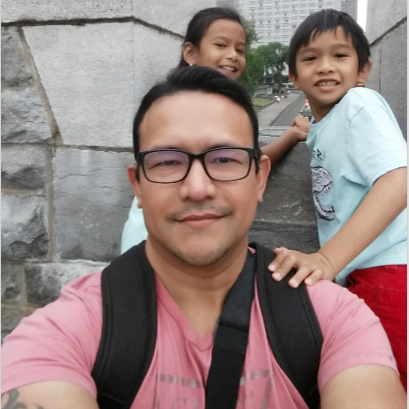

# Didact

You can find the deployed project at [https://didactlms.com](https://didactlms.com).

## Contributors

|                                       [Kodi O'Neil](https://github.com/yutveg)                                        |                                       [Nick Alicaya](https://github.com/NickAlicaya)                                        |                                       [Leighton Fritze](https://leightonfritze.com/)                                        |                                       [Candace Rossi](https://github.com/CandaceRossi)                                        |                                       [Mark Dudlik](http://markdudlik.com/)                                        |                                                                             |                                                                               |
| :-----------------------------------------------------------------------------------------------------------: | :-----------------------------------------------------------------------------------------------------------: | :-----------------------------------------------------------------------------------------------------------: | :-----------------------------------------------------------------------------------------------------------: | :-----------------------------------------------------------------------------------------------------------: | :-----------------------------------------------------------------------------------------------------------: | :-----------------------------------------------------------------------------------------------------------: |
|                                             |                                             |                                             |                                             |                      |                                           |
|                                  |                         |                       |                     |                         |                         |                         |
|  |  |  |  |  |  |  |

 
 
